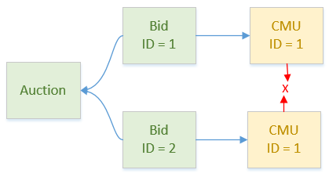

# EF Tracking (same key issue)

## Problem(s) Statement

In certain circumstances, EF complains with the following _InvalidOperationException_:

> The instance of entity type '{type}' cannot be tracked because another instance with the same key value for '{ID}' is already being tracked. When attaching existing entities, ensure that only one entity instance with a given key value is attached. Consider using 'DbContextOptionsBuilder.EnableSensitiveDataLogging' to see the conflicting key values.

This is an issue related to something called _identity resolution_, which is how EF manages to keep track of multiple references to the same entity instance.

In past versions of EF, distinct references of the same instances were kept track of, which prevented facing a situation where multiple instances of the same entity coexisted, but starting with EF Core 3, that behavior was altered for entities loaded via `AsNoTracking()` for performance reasons. The rationale is well explained on this page: [EF Core 3.0 breaking changes](https://docs.microsoft.com/en-us/ef/core/what-is-new/ef-core-3.x/breaking-changes#notrackingresolution).

As the following comment on the `Microsoft.EntityFrameworkCore.DbSet<TEntity>.Update(entity)` EF Core method indicates, calling that very method kickstarts tracking for the given entity and all its sub-properties, recursively, which is when the distinct instances of the same entity are suddenly discovered by EF, and an error is raised:

```C#
...
// A recursive search of the navigation properties will be performed to find reachable
//     entities that are not already being tracked by the context. All entities found
//     will be tracked by the context.
...
```

In our case, we discovered that there was two distinct situations that produced the error.

### Sub-Properties Identity Resolution Mismatch

This situation occurs when instances of sub-properties of an (aggregate root) entity diverge due to mismanaging their identity resolution. Indeed, when the entity (or entities) gets loaded, its sub-properties will all get instantiated as distinct objects, even if some of those are really the same entity (i.e. same Type and ID). Schematized:



That has no drawback as long as we don't write them back in DB. Unfortunately, that is exactly what happens: when saving the root entity, the `DbSet<TEntity>.Update(entity)` method is called, and two separate instances of the same entity are found to exist as sub-properties (actually sub-sub-properties in our particular configuration) and EF raises an error.

### Inappropriate DatabaseContext Lifecycle

The second issue is more serious, because it relates to the design of the application itself. It is due to the reusing/sharing of the same DatabaseContext, a practice discouraged by Microsoft.

When a DatabaseContext is reused across multiple DbSet collections, we run the risk that an entity exists both as an entity in its own DbSet, but also as a sub-property of another entity in another DbSet, making it two separate instances. Even though EF will permit such a situation at reading time, the same error will be raised at saving time.

In order to avoid that, the EF Core team [strongly advises using the Unit-of-Work pattern](https://docs.microsoft.com/en-us/ef/core/dbcontext-configuration/#the-dbcontext-lifetime), and make the DatabaseContext lifespan as brief as necessary, typically to address a single business transaction, but that isn't always easy or possible to achieve.

## Resolution

### Sub-Properties Mismatch Resolution

This was addressed by using [a method taking care of identity resolution introduced in EF Core 5.0](https://docs.microsoft.com/en-us/ef/core/querying/tracking#identity-resolution): `AsNoTrackingWithIdentityResolution()`. That method must be appended to each GetX() type methods, or more sensibly be added as default configuration in Startup.cs, in the DB instantiation configuration:

```C#
services.AddDbContextPool<DataAccess.DatabaseContext>(optionsBuilder =>
{
    optionsBuilder
        .UseSqlServer(Configuration.GetConnectionString("Auction"), (options) => options.CommandTimeout(30) )
        .UseQueryTrackingBehavior(QueryTrackingBehavior.NoTrackingWithIdentityResolution);
});
```
In order to use that EF Core 5.0 method in our .NET Core 3.1/.NET Standard 2.0 solution, we had to upgrade a few projects to .NET Standard 2.1 to abide by the correct [EF Core version compatibility](https://docs.microsoft.com/en-us/ef/core/miscellaneous/platforms). See [Troubleshooting](https://tfs.belgrid.net/EliaCollection/AdeMar/_wiki/wikis/Definition%20of%20Done/231/EF-Tracking-same-key-issue?anchor=troubleshooting) section below for some information on the errors we encountered. Note that these issues will resolve automatically as we move to .NET 5.0.

### DbContext Sharing Resolution

In our case, most of our codebase had already been written when we faced the issue, so in order to stave off a significant refactoring, a quick-fix was introduced: clearing all existing tracked changes after each write operation. Luckily, a lifecycle hook already exists in the DatabaseContext class:

```C#
public override int SaveChanges()
{
    HandleChangeTrackedItemsOnBeforeSave();

    var changes = base.SaveChanges();

    HandleChangeTrackedItemsOnAfterSave();

    return changes;
}

private void HandleChangeTrackedItemsOnAfterSave()
{
    // Set PersistChange to None!
    foreach (var item in ChangeTracker.Entries())
    {
        if (item.Entity is IPersistEntity entity)
            entity.PersistChange = PersistChange.None;
    }

    // Forces detach of all entities of DatabaseContext after write operation, in order to prevent "cannot be tracked because another instance same key" InvalidOperationException.
    // See https://docs.microsoft.com/en-us/ef/core/change-tracking/#how-to-track-entities
    // See https://docs.microsoft.com/en-us/dotnet/api/microsoft.entityframeworkcore.changetracking.changetracker.clear?view=efcore-5.0
    this.ChangeTracker.Clear();
}
```

## Diagnostics

In order to enable more descriptive exceptions raised by EF, the following **DbContext** method can be overriden in _DatabaseContext.cs_:

```C#
// DatabaseContext.cs

#if DEBUG

// Incompatible with DbContext pooling => Debug only (also see Startup.cs).
protected override void OnConfiguring(DbContextOptionsBuilder optionsBuilder)
{
    optionsBuilder.EnableSensitiveDataLogging(true);
    base.OnConfiguring(optionsBuilder);
}

#endif
```
However it is not compatible with DbContext pooling, therefore should only be used locally for debugging, and in conjonction with the following code in _Startup.cs_ that disables DbContext pooling:

```C#
// Startup.cs

#if DEBUG
    // Allows using OnConfiguring() in the DatabaseContext
    services.AddDbContext<DataAccess.DatabaseContext>(optionsBuilder => ...
#else
    services.AddDbContextPool<DataAccess.DatabaseContext>(optionsBuilder => ...
#endif
```

## Troubleshooting

As we upgraded our projects from Standard 2.0 to 2.1, we encountered and fixed the following dependencies-related issues:

### Missing Method

> MissingMethodException: Method not found: 'Boolean Microsoft.EntityFrameworkCore.Migrations.IMigrationsModelDiffer.HasDifferences

This is [caused by using .NET Core 3.1 with EF Core 5.0](https://github.com/dotnet/efcore/issues/22687#issuecomment-718803655). To fix that issue, we had to remove the following line in the _Startup.cs_ class:

```C#
// Startup.cs

app.UseDatabaseErrorPage();
```

### Encoding 1252

>NotSupportedException: No data is available for encoding 1252

That exception was raised by Aspose and is apparently caused by the character set of .NET Core supported character sets being smaller in comparison to .NET Framework. Follow the link on [this issue page](https://forum.aspose.com/t/notsupportedexception-no-data-is-available-for-encoding-1252-exception-on-loading-msg-file-c-net-core/203598/2) for more information and its resolution, which was basically adding a nuget reference (_System.Text.Encoding.CodePages_) and adding the following statement above the Aspose license registration:

```C#
// AsposeStartup.cs

System.Text.Encoding.RegisterProvider(System.Text.CodePagesEncodingProvider.Instance);
```